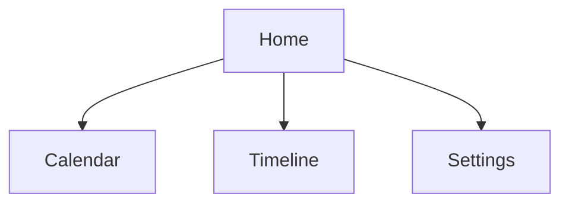

## Toasty Mood 

Toasty Mood is a Single Page App that will help you to review your mood according to the weather and manage your everyday's life tasks. Your experience will be better on a mobile phone. Come try it !



### Dev Team

- [Christopher Raspail](https://github.com/Laynaria)
- [Alicia Dupil](https://github.com/Alicia-Dupil)
- [Vivien Méreaux](https://github.com/Vivien51380)
- [Lana Duval](https://github.com/lanaduval)
- [Mustapha Said](https://github.com/smoosy75)


### Working Methods

- We worked with agile SCRUM methodology

- We made 6 sprints of 1 week : 
  sprint 0 : brainstorming and concept development
  sprint 1 - 4 : features development
  sprint 5 - 6 : details and aesthetic improvements
  
### Tools & Technologies

#Figma
#Git
#Github
#React / Vite Template
#JSX
#CSS
#API

### API reference

[OpenWeather](https://openweathermap.org/)


### Setup

To run this project, install it locally using npm: (only front folder is necessary)

```bash 
npm run setup
npm run dev-front 
